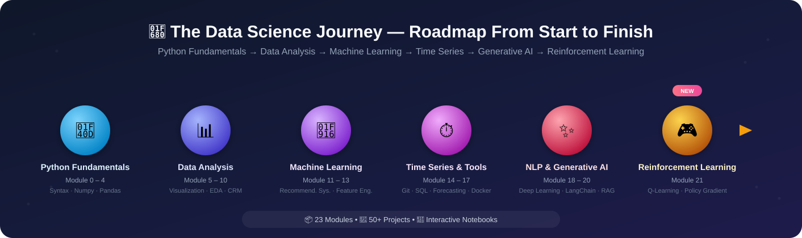

# Alican Kaya Data-Science-RoadMap

[Portfolio](https://alican-kaya.com/) | [LinkedIn](https://www.linkedin.com/in/alican-kaya-881650234/)

🇹🇷 [Türkçe](./README.md) &nbsp;|&nbsp; 🇬🇧 **English** &nbsp;|&nbsp; 🇪🇸 [Español](./README.es-ES.md)

---

    [](https://github.com/AlicanKaya192/Data-Science-RoadMap/actions/workflows/python-app.yml)

   

> [!CAUTION]
> Due to the high interest this project has received, the Git LFS data quota can fill up quickly. If you clone the repository while the quota is full, PDF documents and datasets will download incomplete. To access all files in full, please use the 'Download ZIP' option on the GitHub repository.

---



> ### *From Python to Generative AI — A Comprehensive Data Science Journey* 🚀

### ✨ Highlights

| | |
|---|---|
| 📦 **23 Modules** | End-to-end curriculum from basic Python to Generative AI, Reinforcement Learning, and API Development |
| 🧪 **50+ Applications & Projects** | Hands-on exercises with real datasets |
| 📓 **Interactive Notebooks** | Jupyter Notebooks with executed outputs in visualization-heavy modules |
| 📄 **100+ PDF Documents** | Detailed theoretical explanations and reference materials |
| ✅ **CI-Backed** | Codebase validated with lint + smoke tests on every push |

### 🛠️ Tech Stack

     

     

     

## 📑 Table of Contents
> **Note:** The folders in this repository are numbered according to the learning order. Each module's detailed content lives in its own folder's `README.md`. Click a module name in the table below to jump to it.

* [📌 About the Repository](#-about-the-repository)
* [📚 Learning Roadmap and Contents](#-learning-roadmap-and-contents)
* [📂 Extra Projects and Resources](#-extra-projects-and-resources)
* [📖 Project Status and Progress](#-project-status-and-progress)
* [💡 Recommended Study Methods](#-recommended-study-methods)
* [🤝 Contributing](#-contributing)
* [📜 License](#-license)

[⬆️ Back to Top](#-table-of-contents)

---

## 📚 Learning Roadmap and Contents

| # | Module | Key Topics |
|:-:|---|---|
| 0 | [Python Fundamentals](./0-Python_Temelleri/README.md) | Introduction, data types, OOP, file/database operations |
| 1 | [Working Environment Setup](./01-Çalışma_Ortamı_Ayarları/README.md) | Virtual environments, package management |
| 2 | [Data Structures](./02-Veri_Yapıları/README.md) | String, List, Dictionary, Tuple, Set |
| 3 | [Functions, Conditions, Loops and Comprehensions](./03-Fonksiyonlar,_Koşullar,_Döngüler_anlamalar/README.md) | `if-else`, loops, `lambda`, `map`/`filter`, comprehensions |
| 4 | [Exercises (Python and List Comprehensions)](./04-Egzersizler_Python_ve_List_Comprehensions_/README.md) | Reinforcement exercises |
| 5 | [Numpy](./05-Numpy/README.md) | Array creation, indexing, fancy indexing, mathematical operations |
| 6 | [Pandas](./06-Pandas/README.md) | Series/DataFrame, selection, grouping, `apply`/`lambda`, join |
| 7 | [Data Visualization (Matplotlib & Seaborn)](./07-Veri_Görselleştirme_Matplotlib_&_Seaborn/README.md) | Line, bar, histogram, and scatter plot charts |
| 8 | [Advanced Functional Exploratory Data Analysis (EDA)](./08-Gelişmiş_Fonksiyonel_Keşifçi_Veri_Analizi/README.md) | Categorical/numerical analysis, target variable, correlation |
| 9 | [CRM Analytics](./09-CRM_Analitik/README.md) | RFM, Customer Lifetime Value (CLTV) |
| 10 | [Measurement Problems](./10-Ölçümleme_Problemleri/README.md) | Product/review scoring & ranking, A/B Testing |
| 11 | [Recommendation Systems](./11-Tavsiye_Sistemleri/README.md) | Association rules, content/collaborative filtering, matrix factorization |
| 12 | [Feature Engineering](./12-Feature_Engineering_Özellik_Mühendisliği_/README.md) | Outliers/missing values, encoding, feature extraction |
| 13 | [Machine Learning](./13-Machine_Learning_Makine_Öğrenimi_/README.md) | Regression, KNN, CART, tree methods, case studies |
| 14 | [GIT](./14-GIT/README.md) | Version control fundamentals and advanced usage |
| 15 | [SQL](./15-SQL/README.md) | Database management, querying |
| 16 | [Time Series](./16-Time_Series/README.md) | Smoothing, ARIMA/SARIMA, forecasting with LightGBM |
| 17 | [Docker](./17-Docker/README.md) | Containerization fundamentals |
| 18 | [Deep Learning Path ↗](https://github.com/AlicanKaya192/Deep_Learning_Path) | *(Separate repository)* |
| 19 | [Natural Language Processing (NLP)](./19-Natural_Language_Processing_(NLP)/README.md) | Text preprocessing, sentiment analysis, classification |
| 20 | [Generative AI & Prompt Engineering](./20-Generative_AI_and_Prompt_Engineer/README.md) | LLMs, LangChain, RAG, autonomous agents, fine-tuning |
| 21 | [Reinforcement Learning](./21-Reinforcement_Learning/README.md) | Q-Learning, Policy Gradient (REINFORCE), DQN concepts, Gymnasium environments |
| 22 | [API (Application Programming Interface)](./22-API/README.md) | HTTP, REST design, authentication/security, consuming APIs with Python, building APIs with FastAPI, GraphQL/gRPC/Webhooks |

---

## 📌 About the Repository

This repository is a comprehensive resource containing the notes, sample code, and projects I created while learning the Python programming language. Following a **Data Science and Machine Learning** roadmap, it offers a structure that spans from basic Python topics to advanced data analysis, feature engineering, and machine learning models.

My goal is to document what I've learned along the way in an organized manner, and to build a useful guide for others walking a similar path.

[⬆️ Back to Top](#-table-of-contents)

---

> [!CAUTION]
> ## ⚠️ Critical: Installing the Required Dependencies
>
> To run the code in this repository, you need to install every library listed in **`requirements.txt`**.
>
> ### What is `requirements.txt`?
> This file lists the Python libraries the project needs: **pandas**, **numpy**, **scikit-learn**, **matplotlib**, **seaborn**, **xgboost**, **lightgbm**, **catboost**, **streamlit**, **openai**, **google.generativeai**, and many other data science, machine learning, and generative AI libraries.
>
> `requirements.txt` now installs three separate files together, for backward compatibility. If you only care about one section, you can install the relevant file on its own for a lighter, faster setup:
> - **`requirements-core.txt`** — Modules 0-13, 16, 21, 22 (Classic Data Science, Machine Learning, Reinforcement Learning & API Development)
> - **`requirements-nlp.txt`** — Module 19 (Natural Language Processing)
> - **`requirements-genai.txt`** — Module 20 (Generative AI, LangChain, Agents)
>
> ### Installation Steps:
> ```bash
> # 1. Clone the repository
> git clone https://github.com/AlicanKaya192/Data-Science-RoadMap.git
>
> # 2. Go to the project directory
> cd Data-Science-RoadMap
>
> # 3. (Recommended) Create and activate a virtual environment
> python -m venv venv
> # Windows:
> venv\Scripts\activate
> # macOS/Linux:
> source venv/bin/activate
>
> # 4. Install all dependencies
> pip install -r requirements.txt
> ```
>
> **Note:** Some libraries (e.g. `google.generativeai`, `openai`) may require an API key. For Module 20 (Generative AI), copy [`20-Generative_AI_and_Prompt_Engineer/.env.example`](./20-Generative_AI_and_Prompt_Engineer/.env.example) to `.env` and fill it in with your own keys.

---

## 📂 Extra Projects and Resources

- **Armut ARL Project:** A real-world scenario built around Association Rule Learning.
- **CheatSheets:** Quick-reference sheets for Python, Pandas, Numpy, Matplotlib, Seaborn, SQL, Docker, Machine Learning, and AI Agents.
- **[Datasets](./Datasets_Genel_/README.md):** Archive of the datasets used throughout the exercises. See the link for source and license notes on third-party datasets.
- **Interview Questions:** Questions and solutions to prepare for technical interviews.
- **Mentor Solutions:** Alternative, professional-grade solutions to sample problems.
- **Kahoot! Questions:** Fun quizzes to test what you've learned.
- **[Global CO₂ Analysis & Future Projections](https://github.com/Miuul-Project/Global-CO--Analysis---Future-Projections):** A project on global CO₂ emissions analysis and future projections, including time series analysis, data visualization, and forecasting models.
    > **Note:** This project is best reviewed after the **Machine Learning (13)** and **Time Series (16)** topics.
- **[21 Different Python Projects](https://github.com/AlicanKaya192/21-Farkli-Python-Projeleri):** A collection of 21 projects, beginner to advanced, prepared for practicing along your Python journey — web scraping, a digital desktop clock, QR code generation, and more.
    > **Note:** These projects can be reviewed independently after the **Python Fundamentals (0)** section.
- **[Odyssey](https://github.com/AlicanKaya192/Odyssey):** A desktop-app version of this roadmap — lets you complete sections through lessons, visuals, PDFs, and tests, plus coding exercises that are checked automatically, as a standalone project.

[⬆️ Back to Top](#-table-of-contents)

---

## 📖 Project Status and Progress

  

All **23 modules** in the [Learning Roadmap](#-learning-roadmap-and-contents) table above are **fully completed**.

**Note:** The ordering of items 18, 19, and 20 may change as needed. Additional topics deemed necessary will be added over time, including relevant mathematical foundations.

[⬆️ Back to Top](#-table-of-contents)

---

## 💡 Recommended Study Methods

1. **Follow the order:** Since each topic builds on the previous one, it's recommended to progress in folder-number order.
2. **Practice as you go:** Instead of just reading the code, use the data in the [`Datasets_Genel_`](./Datasets_Genel_/README.md) folder to run your own analyses.
3. **Study the projects:** In particular, work through the end-to-end pipelines in the `09-CRM_Analitik` and `13-Machine_Learning_Makine_Öğrenimi_` folders.

### Algorithm & Coding Practice Sites
* **Hackerrank:** For beginner and intermediate questions.
* **Codewars:** Small, practice-focused challenges.
* **Leetcode:** For intermediate/advanced users (do Hackerrank/Codewars first).
* **Spoj:** Questions only, no code editor. Best used after the other sites.

> **Note:** You can drop into these sites anytime for quick practice. It's recommended to spend more of your time on hands-on dataset practice.

[⬆️ Back to Top](#-table-of-contents)

---

## 🤝 Contributing

Contributions to improve these resources are very welcome — feel free to open a Pull Request or an issue. See **[CONTRIBUTING.md](./CONTRIBUTING.md)** for detailed steps, code standards, and test instructions.

Please read **[CODE_OF_CONDUCT.md](./CODE_OF_CONDUCT.md)** before contributing. If you find a security vulnerability, follow the reporting process in **[SECURITY.md](./SECURITY.md)**.

### Quick Start

```bash
# 1. Fork the repository (on GitHub)

# 2. Clone your fork
git clone https://github.com/YOUR_USERNAME/Data-Science-RoadMap.git

# 3. Create a new branch
git checkout -b feature/new-feature

# 4. Make your changes and commit
git add .
git commit -m "feat: description of the new feature"

# 5. Push your branch
git push origin feature/new-feature

# 6. Open a Pull Request on GitHub (fill in the PR template checklist)
```

---

## 📜 License

This project is licensed under the **MIT License**. See the [LICENSE](LICENSE) file for details.

> **Summary:** This repository is open source. You may use, modify, and redistribute its contents for personal, commercial, or educational purposes. However, attribution to the source and preservation of the license notice are required. Contributions back to the project's open-source nature are always appreciated.

[⬆️ Back to Top](#-table-of-contents)
