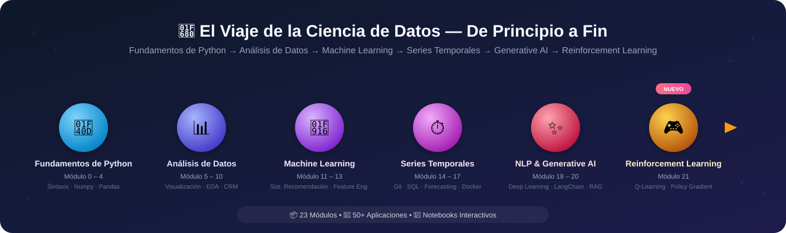

# Alican Kaya Data-Science-RoadMap

[Portfolio](https://alican-kaya.com/) | [LinkedIn](https://www.linkedin.com/in/alican-kaya-881650234/)

🇹🇷 [Türkçe](./README.md) &nbsp;|&nbsp; 🇬🇧 [English](./README.en.md) &nbsp;|&nbsp; 🇪🇸 **Español**

---

    [](https://github.com/AlicanKaya192/Data-Science-RoadMap/actions/workflows/python-app.yml)

   

> [!CAUTION]
>Debido al gran interés que ha despertado este proyecto, la cuota de datos de Git LFS se está agotando rápidamente. Si clona el repositorio cuando la cuota esté llena, los documentos PDF y los conjuntos de datos se descargarán incompletos. Para acceder a todos los archivos por completo, utilice la opción 'Descargar ZIP' (Download ZIP) en el repositorio de GitHub.

---



> ### *De Python a Generative AI: Un viaje completo de Ciencia de Datos* 🚀

### ✨ Destacados

| | |
|---|---|
| 📦 **23 Módulos** | Plan de estudios completo de Python básico a Generative AI, Reinforcement Learning y Desarrollo de APIs |
| 🧪 **50+ Aplicaciones & Proyectos** | Trabajos prácticos con conjuntos de datos reales |
| 📓 **Notebooks Interactivos** | Jupyter Notebook con salidas ejecutadas en módulos centrados en visualización |
| 📄 **100+ Documentos PDF** | Explicaciones teóricas detalladas y materiales de referencia |
| ✅ **Soportado por CI** | Base de código validada con lint + pruebas smoke en cada push |

### 🛠️ Stack Tecnológico

     

     

     

## 📑 Tabla de Contenidos
> **Nota:** Las carpetas dentro del repositorio están numeradas según el orden de aprendizaje. El contenido detallado de cada módulo se encuentra en el archivo `README.md` de su propia carpeta. Por favor, haga clic en los nombres de los módulos de la tabla a continuación para navegar a cada módulo.

* [📌 Sobre el Repositorio](#-sobre-el-repositorio)
* [📚 Mapa de Aprendizaje y Contenidos](#-mapa-de-aprendizaje-y-contenidos)
* [📂 Proyectos y Recursos Adicionales](#-proyectos-y-recursos-adicionales)
* [📖 Estado e Progreso del Proyecto](#-estado-e-progreso-del-proyecto)
* [💡 Métodos de Estudio Recomendados](#-métodos-de-estudio-recomendados)
* [🤝 Cómo Contribuir](#-cómo-contribuir)
* [📜 Licencia](#-licencia)

[⬆️ Volver al Inicio](#-tabla-de-contenidos)

---

## 📚 Mapa de Aprendizaje y Contenidos

| # | Módulo | Títulos de Temas |
|:-:|---|---|
| 0 | [Fundamentos de Python](./0-Python_Temelleri/README.md) | Introducción, tipos de datos, POO, operaciones de archivos/bases de datos |
| 1 | [Configuración del Entorno de Trabajo](./01-Çalışma_Ortamı_Ayarları/README.md) | Entorno virtual, gestión de paquetes |
| 2 | [Estructuras de Datos](./02-Veri_Yapıları/README.md) | String, List, Dictionary, Tuple, Set |
| 3 | [Funciones, Condiciones, Bucles y Comprehensions](./03-Fonksiyonlar,_Koşullar,_Döngüler_anlamalar/README.md) | `if-else`, bucles, `lambda`, `map`/`filter`, comprehensions |
| 4 | [Ejercicios (Python y List Comprehensions)](./04-Egzersizler_Python_ve_List_Comprehensions_/README.md) | Ejercicios de reforzamiento |
| 5 | [Numpy](./05-Numpy/README.md) | Creación de arrays, indexación, fancy index, operaciones matemáticas |
| 6 | [Pandas](./06-Pandas/README.md) | Series/DataFrame, selección, agrupación, `apply`/`lambda`, join |
| 7 | [Visualización de Datos (Matplotlib & Seaborn)](./07-Veri_Görselleştirme_Matplotlib_&_Seaborn/README.md) | Gráficos de líneas, barras, histogramas, scatter plot |
| 8 | [Análisis Exploratorio de Datos Avanzado (EDA)](./08-Gelişmiş_Fonksiyonel_Keşifçi_Veri_Analizi/README.md) | Análisis categórico/numérico, variable objetivo, correlación |
| 9 | [Analítica CRM](./09-CRM_Analitik/README.md) | RFM, Valor de Vida del Cliente (CLTV) |
| 10 | [Problemas de Medición](./10-Ölçümleme_Problemleri/README.md) | Puntuación/clasificación de productos/comentarios, Pruebas A/B |
| 11 | [Sistemas de Recomendación](./11-Tavsiye_Sistemleri/README.md) | Reglas de asociación, filtrado basado en contenido/colaborativo, factorización de matrices |
| 12 | [Ingeniería de Características (Feature Engineering)](./12-Feature_Engineering_Özellik_Mühendisliği_/README.md) | Valores atípicos/faltantes, codificación, extracción de características |
| 13 | [Machine Learning (Aprendizaje Automático)](./13-Machine_Learning_Makine_Öğrenimi_/README.md) | Regresión, KNN, CART, métodos de árboles, estudios de caso |
| 14 | [GIT](./14-GIT/README.md) | Fundamentos de control de versiones y uso avanzado |
| 15 | [SQL](./15-SQL/README.md) | Gestión de bases de datos, consultas |
| 16 | [Series Temporales](./16-Time_Series/README.md) | Suavización, ARIMA/SARIMA, predicción con LightGBM |
| 17 | [Docker](./17-Docker/README.md) | Fundamentos de contenedorización |
| 18 | [Ruta de Deep Learning ↗](https://github.com/AlicanKaya192/Deep_Learning_Path) | *(Repositorio separado)* |
| 19 | [Procesamiento de Lenguaje Natural (NLP)](./19-Natural_Language_Processing_(NLP)/README.md) | Preprocesamiento de texto, análisis de sentimiento, clasificación |
| 20 | [Generative AI & Prompt Engineering](./20-Generative_AI_and_Prompt_Engineer/README.md) | LLMs, LangChain, RAG, agentes autónomos, ajuste fino |
| 21 | [Reinforcement Learning](./21-Reinforcement_Learning/README.md) | Q-Learning, Policy Gradient (REINFORCE), conceptos de DQN, entornos Gymnasium |
| 22 | [API (Application Programming Interface)](./22-API/README.md) | HTTP, diseño REST, autenticación/seguridad, consumo de APIs con Python, creación de APIs con FastAPI, GraphQL/gRPC/Webhooks |

---

## 📌 Sobre el Repositorio

Este repositorio es un recurso integral que contiene mis notas, ejemplos de código y proyectos creados durante mi proceso de aprendizaje del lenguaje de programación Python. Siguiendo el mapa de ruta de **Ciencia de Datos y Aprendizaje Automático**, ofrece una estructura que abarca desde temas básicos de Python hasta análisis de datos avanzado, ingeniería de características y modelos de aprendizaje automático.

Mi objetivo es documentar lo que he aprendido de manera organizada y crear una guía útil para aquellos que sigan un camino similar.

[⬆️ Volver al Inicio](#-tabla-de-contenidos)

---

> [!CAUTION]
> ## ⚠️ Crítico: Instalación de las Dependencias Requeridas
> 
> Para ejecutar el código de este repositorio, es necesario instalar todas las bibliotecas listadas en el archivo **`requirements.txt`**.
> 
> ### ¿Qué es `requirements.txt`?
> Este archivo contiene la lista de bibliotecas de Python que el proyecto necesita. Incluye: **pandas**, **numpy**, **scikit-learn**, **matplotlib**, **seaborn**, **xgboost**, **lightgbm**, **catboost**, **streamlit**, **openai**, **google.generativeai** y muchas otras bibliotecas de ciencia de datos, aprendizaje automático e IA generativa.
>
> Actualmente, `requirements.txt` instala tres archivos separados en conjunto con fines de compatibilidad. Si solo está interesado en una sección específica, puede instalar el archivo correspondiente por separado para una instalación más ligera/rápida:
> - **`requirements-core.txt`** — Módulos 0-13, 16, 21, 22 (Ciencia de Datos Clásica, Aprendizaje Automático, Reinforcement Learning & Desarrollo de APIs)
> - **`requirements-nlp.txt`** — Módulo 19 (Procesamiento de Lenguaje Natural)
> - **`requirements-genai.txt`** — Módulo 20 (Generative AI, LangChain, Agentes)
>
> ### Pasos de Instalación:
> ```bash
> # 1. Clone el repositorio
> git clone https://github.com/AlicanKaya192/Data-Science-RoadMap.git
> 
> # 2. Navegue al directorio del proyecto
> cd Data-Science-RoadMap
> 
> # 3. (Recomendado) Cree y active un entorno virtual
> python -m venv venv
> # Windows:
> venv\Scripts\activate
> # macOS/Linux:
> source venv/bin/activate
> 
> # 4. Instale todas las dependencias
> pip install -r requirements.txt
> ```
> 
> **Nota:** Algunas bibliotecas (ej: `google.generativeai`, `openai`) pueden requerir una clave API. Para el Módulo 20 (Generative AI), copie el archivo [`20-Generative_AI_and_Prompt_Engineer/.env.example`](./20-Generative_AI_and_Prompt_Engineer/.env.example) como `.env` y rellénelo con sus propias claves.

---

## 📂 Proyectos y Recursos Adicionales

- **Proyecto Armut ARL:** Escenario del mundo real sobre Aprendizaje de Reglas de Asociación (Association Rule Learning).
- **CheatSheets:** Hojas de referencia rápidas para Python, Pandas, Numpy, Matplotlib, Seaborn, SQL, Docker, Machine Learning y AI Agents.
- **[Datasets](./Datasets_Genel_/README.md):** Archivo de conjuntos de datos utilizados en los trabajos. Consulte el enlace para notas de fuente y licencia de conjuntos de datos de terceros.
- **Preguntas de Entrevista:** Preguntas y soluciones para prepararse para entrevistas técnicas.
- **Soluciones de Mentor:** Soluciones alternativas y profesionales para problemas de ejemplo.
- **Preguntas de Kahoot!:** Cuestiones divertidas para probar el conocimiento adquirido.
- **[Global CO₂ Analysis & Future Projections](https://github.com/Miuul-Project/Global-CO--Analysis---Future-Projections):** Proyecto de análisis de emisiones globales de CO₂ y proyecciones futuras. Incluye análisis de series temporales, visualización de datos y modelos de predicción.
    > **Nota:** Este proyecto debe revisarse después de los temas de **Machine Learning (13)** y **Time Series (16)**.
- **[21 Diferentes Proyectos de Python](https://github.com/AlicanKaya192/21-Farkli-Python-Projeleri):** Colección de 21 proyectos diferentes diseñados para practicar desde nivel inicial hasta avanzado en el camino de aprendizaje de Python. Web Scraping, Reloj de Escritorio Digital, Generación de Códigos QR y más.
    > **Nota:** Estos proyectos pueden estudiarse de forma independiente después de la sección **Python Temelleri (0)**.
- **[Odyssey](https://github.com/AlicanKaya192/Odyssey):** Versión de escritorio de este roadmap — permite completar las secciones mediante lecciones, imágenes, PDFs y exámenes, además de ejercicios de código que se comprueban automáticamente, como proyecto independiente.

[⬆️ Volver al Inicio](#-tabla-de-contenidos)

---

## 📖 Estado e Progreso del Proyecto

  

Los **23 módulos** completos de la tabla de [Mapa de Aprendizaje](#-mapa-de-aprendizaje-y-contenidos) están en estado **finalizados**.

**Nota:** El orden de los puntos 18, 19 y 20 puede cambiarse según sea necesario. Se agregarán encabezados adicionales si se considera necesario. Además, se incluirán los conceptos matemáticos que deben conocerse.

[⬆️ Volver al Inicio](#-tabla-de-contenidos)

---

## 💡 Métodos de Estudio Recomendados

1. **Siga el orden:** Dado que los temas se construyen unos sobre otros, se recomienda avanzar según el número de las carpetas.
2. **Practique:** En lugar de solo leer el código, realice sus propios análisis utilizando los datos de la carpeta [`Datasets_Genel_`](./Datasets_Genel_/README.md).
3. **Revise los proyectos:** Específicamente, intente comprender los proyectos integrales (pipelines) en las carpetas `09-CRM_Analitik` y `13-Machine_Learning_Makine_Öğrenimi_`.

### Sitios de Práctica de Algoritmos y Código
* **Hackerrank:** Para preguntas de nivel inicial e intermedio.
* **Codewars:** Tareas pequeñas centradas en la práctica.
* **Leetcode:** Para usuarios de nivel intermedio y avanzado (se debe completar Hackerrank/Codewars primero).
* **Spoj:** Solo contiene preguntas, sin editor de código. Puede usarse después de los otros sitios.

> **Nota:** Puede ingresar a estos sitios en cualquier momento para hacer pequeñas prácticas. Se recomienda dedicar más tiempo a practicar con conjuntos de datos.

[⬆️ Volver al Inicio](#-tabla-de-contenidos)

---

## 🤝 Cómo Contribuir

Quienes deseen contribuir al desarrollo de estos recursos pueden abrir PR (Pull Request) e issues — son totalmente bienvenidos. Consulta **[CONTRIBUTING.md](./CONTRIBUTING.md)** (en turco/inglés) para ver los pasos detallados, estándares de código e instrucciones de prueba.

Por favor lee **[CODE_OF_CONDUCT.md](./CODE_OF_CONDUCT.md)** antes de contribuir. Si encuentras una vulnerabilidad de seguridad, sigue el proceso descrito en **[SECURITY.md](./SECURITY.md)**.

### Inicio Rápido

```bash
# 1. Haz fork del repositorio (a través de GitHub)

# 2. Clona tu fork
git clone https://github.com/TU_USUARIO/Data-Science-RoadMap.git

# 3. Crea una nueva rama
git checkout -b feature/nueva-funcionalidad

# 4. Realiza tus cambios y haz commit
git add .
git commit -m "feat: Descripción de la nueva funcionalidad"

# 5. Haz push de tu rama
git push origin feature/nueva-funcionalidad

# 6. Abre un Pull Request a través de GitHub (completa la lista de verificación de la plantilla)
```

---

## 📜 Licencia

Este proyecto está licenciado bajo la **MIT License**. Consulte el archivo [LICENSE](LICENSE) para más detalles.

> **Resumen:** Este repositorio es de código abierto. Puede usar, modificar y distribuir su contenido con fines personales, comerciales o educativos. Sin embargo, se debe acreditar la fuente y conservar la declaración de licencia. Siempre se agradece su contribución a la naturaleza de código abierto del proyecto.

[⬆️ Volver al Inicio](#-tabla-de-contenidos)
