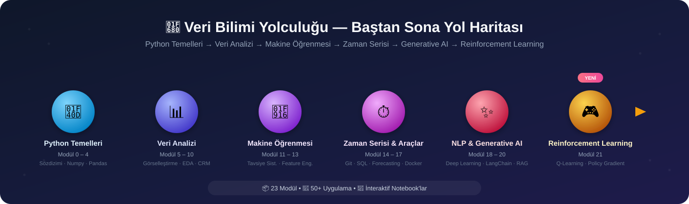

# Alican Kaya Data-Science-RoadMap

[Portfolio](https://alican-kaya.com/) | [LinkedIn](https://www.linkedin.com/in/alican-kaya-881650234/)

🇹🇷 **Türkçe** &nbsp;|&nbsp; 🇬🇧 [English](./README.en.md) &nbsp;|&nbsp; 🇪🇸 [Español](./README.es-ES.md)

---

    [](https://github.com/AlicanKaya192/Data-Science-RoadMap/actions/workflows/python-app.yml)

   

> [!CAUTION]
>Bu projenin yoğun ilgi görmesi sebebiyle Git LFS veri kotası hızla dolabilmektedir. Kotanın dolduğu durumlarda repoyu klonlarsanız PDF dokümanları ve veri setleri eksik inecektir. Tüm dosyalara eksiksiz ulaşabilmek için lütfen GitHub reposundaki 'Son Sürümü İndir' (Download ZIP) seçeneğini kullanınız.

---



> ### *Python'dan Generative AI'a — Kapsamlı Veri Bilimi Yolculuğu* 🚀

### ✨ Öne Çıkanlar

| | |
|---|---|
| 📦 **23 Modül** | Temel Python'dan Generative AI, Reinforcement Learning ve API Geliştirmeye kadar uçtan uca müfredat |
| 🧪 **50+ Uygulama & Proje** | Gerçek veri setleri ile uygulamalı çalışmalar |
| 📓 **İnteraktif Notebook'lar** | Görselleştirme ağırlıklı modüllerde çalıştırılmış çıktılarıyla Jupyter Notebook |
| 📄 **100+ PDF Doküman** | Detaylı teorik açıklamalar ve referans materyalleri |
| ✅ **CI Destekli** | Her push'ta lint + smoke test ile doğrulanan kod tabanı |

### 🛠️ Teknoloji Stack

     

     

     

## 📑 İçindekiler
> **Not:** Repository içerisindeki klasörler, öğrenim sırasına göre numaralandırılmıştır. Her modülün detaylı içeriği kendi klasöründeki `README.md` dosyasında yer almaktadır. Lütfen aşağıdaki tablodaki modül adlarına tıklayarak ilgili modüle gidiniz.

* [📌 Repository Hakkında](#-repository-hakkında)
* [📚 Öğrenim Yol Haritası ve İçerikler](#-öğrenim-yol-haritası-ve-i̇çerikler)
* [📂 Ekstra Projeler ve Kaynaklar](#-ekstra-projeler-ve-kaynaklar)
* [📖 Proje Durumu ve İlerleme](#-proje-durumu-ve-ilerleme)
* [💡 Önerilen Çalışma Yöntemleri](#-önerilen-çalışma-yöntemleri)
* [🤝 Katkıda Bulunma](#-katkıda-bulunma)
* [📜 Lisans](#-lisans)

[⬆️ Başa Dön](#-i̇çindekiler)

---

## 📚 Öğrenim Yol Haritası ve İçerikler

| # | Modül | Konu Başlıkları |
|:-:|---|---|
| 0 | [Python Temelleri](./0-Python_Temelleri/README.md) | Giriş, veri tipleri, OOP, dosya/veritabanı işlemleri |
| 1 | [Çalışma Ortamı Ayarları](./01-Çalışma_Ortamı_Ayarları/README.md) | Sanal ortam, paket yönetimi |
| 2 | [Veri Yapıları](./02-Veri_Yapıları/README.md) | String, List, Dictionary, Tuple, Set |
| 3 | [Fonksiyonlar, Koşullar, Döngüler ve Comprehensions](./03-Fonksiyonlar,_Koşullar,_Döngüler_anlamalar/README.md) | `if-else`, döngüler, `lambda`, `map`/`filter`, comprehensions |
| 4 | [Egzersizler (Python ve List Comprehensions)](./04-Egzersizler_Python_ve_List_Comprehensions_/README.md) | Pekiştirme alıştırmaları |
| 5 | [Numpy](./05-Numpy/README.md) | Array oluşturma, indeksleme, fancy index, matematiksel işlemler |
| 6 | [Pandas](./06-Pandas/README.md) | Series/DataFrame, seçim, gruplama, `apply`/`lambda`, join |
| 7 | [Veri Görselleştirme (Matplotlib & Seaborn)](./07-Veri_Görselleştirme_Matplotlib_&_Seaborn/README.md) | Çizgi, sütun, histogram, scatter plot |
| 8 | [Gelişmiş Fonksiyonel Keşifçi Veri Analizi (EDA)](./08-Gelişmiş_Fonksiyonel_Keşifçi_Veri_Analizi/README.md) | Kategorik/sayısal analiz, hedef değişken, korelasyon |
| 9 | [CRM Analitik](./09-CRM_Analitik/README.md) | RFM, Müşteri Yaşam Boyu Değeri (CLTV) |
| 10 | [Ölçümleme Problemleri](./10-Ölçümleme_Problemleri/README.md) | Ürün/yorum puanlama-sıralama, A/B Testing |
| 11 | [Tavsiye Sistemleri](./11-Tavsiye_Sistemleri/README.md) | Birliktelik kuralı, içerik/işbirlikçi filtreleme, matris faktörleştirme |
| 12 | [Feature Engineering (Özellik Mühendisliği)](./12-Feature_Engineering_Özellik_Mühendisliği_/README.md) | Aykırı/eksik değerler, encoding, feature extraction |
| 13 | [Machine Learning (Makine Öğrenimi)](./13-Machine_Learning_Makine_Öğrenimi_/README.md) | Regresyon, KNN, CART, ağaç yöntemleri, case study'ler |
| 14 | [GIT](./14-GIT/README.md) | Versiyon kontrol temelleri ve ileri kullanım |
| 15 | [SQL](./15-SQL/README.md) | Veritabanı yönetimi, sorgulama |
| 16 | [Time Series](./16-Time_Series/README.md) | Smoothing, ARIMA/SARIMA, LightGBM ile tahminleme |
| 17 | [Docker](./17-Docker/README.md) | Konteynerizasyon temelleri |
| 18 | [Deep Learning Path ↗](https://github.com/AlicanKaya192/Deep_Learning_Path) | *(Ayrı repository)* |
| 19 | [Natural Language Processing (NLP)](./19-Natural_Language_Processing_(NLP)/README.md) | Metin ön işleme, duygu analizi, sınıflandırma |
| 20 | [Generative AI & Prompt Engineering](./20-Generative_AI_and_Prompt_Engineer/README.md) | LLM'ler, LangChain, RAG, otonom ajanlar, fine-tuning |
| 21 | [Reinforcement Learning](./21-Reinforcement_Learning/README.md) | Q-Learning, Policy Gradient (REINFORCE), DQN kavramları, Gymnasium ortamları |
| 22 | [API (Application Programming Interface)](./22-API/README.md) | HTTP, REST tasarımı, kimlik doğrulama/güvenlik, Python ile API tüketme, FastAPI ile API geliştirme, GraphQL/gRPC/Webhook |

---

## 📌 Repository Hakkında

Bu repository, Python programlama dili öğrenim sürecimde oluşturduğum notları, örnek kodları ve projeleri içeren kapsamlı bir kaynaktır. **Veri Bilimi ve Makine Öğrenimi** yol haritasını takip ederek; temel Python konularından başlayıp, ileri seviye veri analizi, özellik mühendisliği ve makine öğrenimi modellerine kadar uzanan bir yapı sunmaktadır.

Amacım, bu süreçte öğrendiklerimi organize bir şekilde belgelemek ve benzer yoldan geçenler için faydalı bir rehber oluşturmaktır.

[⬆️ Başa Dön](#-i̇çindekiler)

---

> [!CAUTION]
> ## ⚠️ Kritik: Gerekli Bağımlılıkların Kurulumu
> 
> Bu repository'deki kodları çalıştırabilmek için **`requirements.txt`** dosyasındaki tüm kütüphanelerin yüklenmesi gerekmektedir.
> 
> ### `requirements.txt` Nedir?
> Bu dosya, projenin ihtiyaç duyduğu Python kütüphanelerinin listesini içerir. İçeriğinde; **pandas**, **numpy**, **scikit-learn**, **matplotlib**, **seaborn**, **xgboost**, **lightgbm**, **catboost**, **streamlit**, **openai**, **google.generativeai** ve daha birçok veri bilimi, makine öğrenimi ve üretken AI kütüphanesi bulunmaktadır.
>
> `requirements.txt` artık geriye dönük uyumluluk amacıyla üç ayrı dosyayı bir arada kurar. Sadece belirli bir bölümle ilgileniyorsanız daha hafif/hızlı bir kurulum için ilgili dosyayı tek başına da kurabilirsiniz:
> - **`requirements-core.txt`** — Modül 0-13, 16, 21, 22 (Klasik Veri Bilimi, Makine Öğrenimi, Reinforcement Learning & API Geliştirme)
> - **`requirements-nlp.txt`** — Modül 19 (Doğal Dil İşleme)
> - **`requirements-genai.txt`** — Modül 20 (Generative AI, LangChain, Ajanlar)
>
> ### Kurulum Adımları:
> ```bash
> # 1. Repository'yi klonlayın
> git clone https://github.com/AlicanKaya192/Data-Science-RoadMap.git
> 
> # 2. Proje dizinine gidin
> cd Data-Science-RoadMap
> 
> # 3. (Önerilen) Sanal ortam oluşturun ve aktif edin
> python -m venv venv
> # Windows:
> venv\Scripts\activate
> # macOS/Linux:
> source venv/bin/activate
> 
> # 4. Tüm bağımlılıkları yükleyin
> pip install -r requirements.txt
> ```
> 
> **Not:** Bazı kütüphaneler (örn: `google.generativeai`, `openai`) API anahtarı gerektirebilir. Modül 20 (Generative AI) için [`20-Generative_AI_and_Prompt_Engineer/.env.example`](./20-Generative_AI_and_Prompt_Engineer/.env.example) dosyasını `.env` olarak kopyalayıp kendi anahtarlarınızla doldurun.

---

## 📂 Ekstra Projeler ve Kaynaklar

- **Armut ARL Projesi:** Birliktelik Kuralı Öğrenimi (Association Rule Learning) üzerine gerçek hayat senaryosu.
- **CheatSheets:** Python, Pandas, Numpy, Matplotlib, Seaborn, SQL, Docker, Machine Learning ve AI Agents için hızlı başvuru kağıtları.
- **[Datasets](./Datasets_Genel_/README.md):** Çalışmalarda kullanılan veri setleri arşivi. Üçüncü taraf veri setlerinin kaynak ve lisans notları için bağlantıya bakınız.
- **Mülakat Soruları:** Teknik mülakatlara hazırlık için soru ve çözümler.
- **Mentor Çözümleri:** Örnek problemlerin alternatif ve profesyonel çözümleri.
- **Kahoot! Soruları:** Öğrenilen bilgileri test etmek için eğlenceli quizler.
- **[Global CO₂ Analysis & Future Projections](https://github.com/Miuul-Project/Global-CO--Analysis---Future-Projections):** Küresel CO₂ emisyon analizi ve gelecek projeksiyonları projesi. Zaman serisi analizi, veri görselleştirme ve tahminleme modelleri içerir.
    > **Not:** Bu proje, **Machine Learning (13)** ve **Time Series (16)** konularından sonra incelenmelidir.
- **[21 Farklı Python Projesi](https://github.com/AlicanKaya192/21-Farkli-Python-Projeleri):** Python öğrenme yolculuğunda pratik yapmak için hazırlanmış, başlangıçtan ileri seviyeye kadar 21 farklı proje koleksiyonu. Web Scraping, Dijital Masaüstü Saati, QR Kod oluşturma ve daha fazlası.
    > **Not:** Bu projeler, **Python Temelleri (0)** bölümünden sonra bağımsız olarak incelenebilir.
- **[Odyssey](https://github.com/AlicanKaya192/Odyssey):** Bu roadmap'in masaüstü uygulaması haline getirilmiş hali — konu anlatımları, görseller, PDF'ler ve testlerin yanı sıra otomatik kontrol edilen kodlama alıştırmalarıyla bölümleri tamamlayarak öğrenmeyi sağlayan bağımsız bir proje.

[⬆️ Başa Dön](#-i̇çindekiler)

---

## 📖 Proje Durumu ve İlerleme

  

Yukarıdaki [Öğrenim Yol Haritası](#-öğrenim-yol-haritası-ve-i̇çerikler) tablosundaki **23 modülün tamamı tamamlanmış** durumdadır.

**Not:** 18, 19 ve 20. maddelerin sıralaması ihtiyaca göre değiştirilebilir. Gerekli görülen ek başlıklar ilave edilecektir. Ayrıca, bilinmesi gereken matematiksel konular da kapsama dahil edilecektir.

[⬆️ Başa Dön](#-i̇çindekiler)

---

## 💡 Önerilen Çalışma Yöntemleri

1. **Sırayı Takip Edin:** Konular birbirinin üzerine inşa edildiği için klasör numaralarına göre ilerlemeniz tavsiye edilir.
2. **Uygulama Yapın:** Sadece kodları okumak yerine, [`Datasets_Genel_`](./Datasets_Genel_/README.md) klasöründeki verileri kullanarak kendi analizlerinizi yapın.
3. **Projeleri İnceleyin:** Özellikle `09-CRM_Analitik` ve `13-Machine_Learning_Makine_Öğrenimi_` klasörlerindeki uçtan uca projeleri (pipeline) anlamaya çalışın.

### Algoritma ve Kod Pratiği Siteleri
* **Hackerrank:** Başlangıç ve orta seviye sorular için.
* **Codewars:** Küçük, pratik odaklı görevler.
* **Leetcode:** Orta ve ileri seviye kullanıcılar için (önce Hackerrank/Codewars yapılmalı).
* **Spoj:** Sadece sorular içerir, kod editörü yok. Diğer sitelerden sonra kullanılabilir.

> **Not:** Bu sitelere istediğiniz zaman girip ufak pratikler yapabilirsiniz. Veri seti pratiğine daha fazla vakit ayırmanız önerilir.

[⬆️ Başa Dön](#-i̇çindekiler)

---

## 🤝 Katkıda Bulunma

Bu kaynakların geliştirilmesine katkıda bulunmak isteyenler için PR (Pull Request) ve issue'lar açmak tamamen açıktır. Detaylı adımlar, kod standartları ve test çalıştırma talimatları için **[CONTRIBUTING.md](./CONTRIBUTING.md)** dosyasına bakınız.

Katkıda bulunmadan önce lütfen **[CODE_OF_CONDUCT.md](./CODE_OF_CONDUCT.md)**'yi okuyunuz. Bir güvenlik açığı bulduysanız **[SECURITY.md](./SECURITY.md)**'deki bildirim sürecini takip ediniz.

### Hızlı Başlangıç

```bash
# 1. Repository'yi fork edin (GitHub üzerinden)

# 2. Fork'unuzu klonlayın
git clone https://github.com/KULLANICI_ADINIZ/Data-Science-RoadMap.git

# 3. Yeni bir branch oluşturun
git checkout -b feature/yeni-ozellik

# 4. Değişikliklerinizi yapın ve commit edin
git add .
git commit -m "feat: Yeni özellik açıklaması"

# 5. Branch'inizi push edin
git push origin feature/yeni-ozellik

# 6. GitHub üzerinden Pull Request açın (PR şablonundaki kontrol listesini doldurun)
```

---

## 📜 Lisans

Bu proje **MIT License** altında lisanslanmıştır. Detaylar için [LICENSE](LICENSE) dosyasına bakınız.

> **Özet:** Bu repository açık kaynaklıdır. İçerikleri kişisel, ticari veya eğitim amaçlı kullanabilir, değiştirebilir ve dağıtabilirsiniz. Ancak kaynağın belirtilmesi (atıf yapılması) ve lisans bildiriminin korunması gerekmektedir. Projenin açık kaynak doğasına katkı vermeniz her zaman takdir edilir.

[⬆️ Başa Dön](#-i̇çindekiler)
